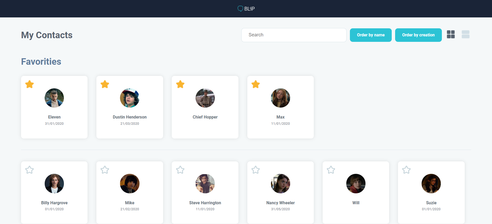

<h3 align="center">
    
     
    

      <b>Teste Prático</b> 
    

</h3>

  

# Indice

- [Sobre](#-sobre)
- [Screenshots](#-sobre)
- [Tecnologias Utilizadas](#-tecnologias-utilizadas)
- [To do](#-todo)

## 🔖 Sobre

Teste pático.

## 📷 Screenshots

<h1>
    
</h1>

## 🚀 Tecnologias utilizadas

Este projeto foi desenvolvido com as seguintes tecnologias:

- [React](https://pt-br.reactjs.org/)
- [Styled Components](https://styled-components.com/)

## Todo

- [ ] Responsividade;
- [ ] Typescript;
- [ ] Publicação;

---

<h4 align="center">
    Feito com ❤️ by <a href="https://github.com/axeldouglas" target="_blank">Axel Douglas</a>
</h4>